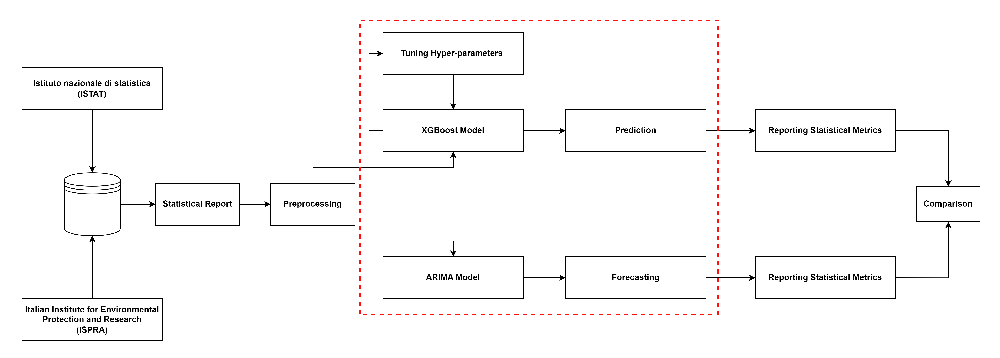

# README

This repository contains the source code for the study described in the paper "Exploring the Relationship between Air Pollution and CNS Disease Mortality in Italy: A Forecasting Study with ARIMA and XGBoost" submitted to IEEE ..... 

Air pollution is a significant environmental health
concern that may have negative consequences on human health,
such as an increase in the prevalence of cardiovascular and
respiratory disorders. From 2010 to 2020, we studied data on
air pollution and mortality due to central nervous system (CNS)
diseases, such as Alzheimer and Parkinson, in 107 Italian cities.
We applied data cleaning, processing, and normalization, fol-
lowed by the Autoregressive Integrated Moving Average (ARIMA)
model and Extreme Gradient Boosting (XGBoost) with grid
search to predict the death numbers caused by CNS disease in
2020. The PM2.5 and PM10 concentrations and the number of
CNS disease-related fatalities were accurately predicted by both
models, according to our findings. The ARIMA model showed
relatively better results with respect to the XGBoost model.
In contrast to the ARIMA model, the XGBoost model needed
more computational training time to train the model. Our
results illustrate the potential advantages of machine learning
algorithms for predictive modeling in the environmental and
public health areas. We want to investigate other machine
learning models, such as neural networks and random forests,
to enhance the prediction performance of our model in future
work. In order to account for any confounding variables that
might affect PM concentrations and CNS illness outcomes,
we want to include other characteristics such as weather and
demographic data. 

### Workflow Diagram

## Installation

1. Clone the repository:

git clone https://github.com/Dechosenone/CNS_prediction.git

2. Install the required packages:

pip install -r requirements.txt

## Data

The data used in the experiments is available at [ISTAT](https://www.istat.it/) and [ISPRA](https://www.isprambiente.gov.it/en/istitute/index). 

## Citation

If you use this code for your research, please cite our paper:

## Authors

